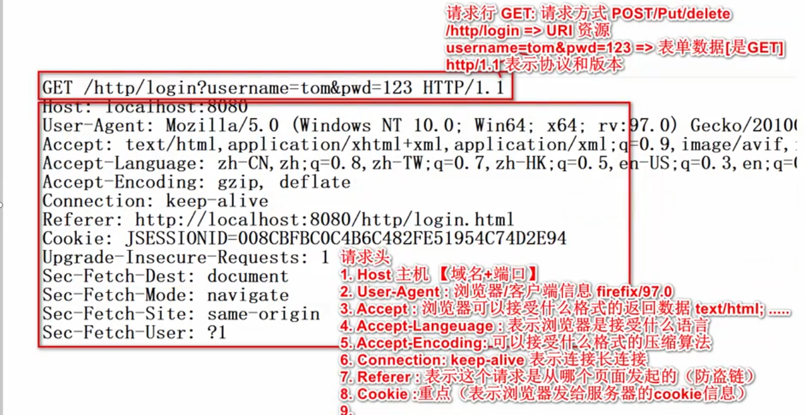
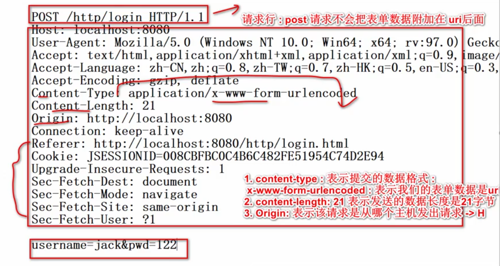
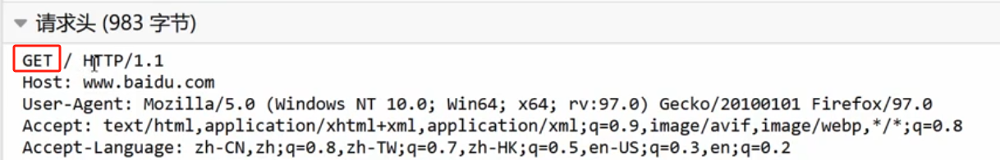
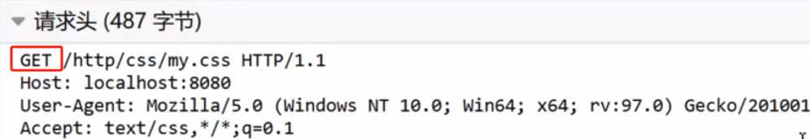
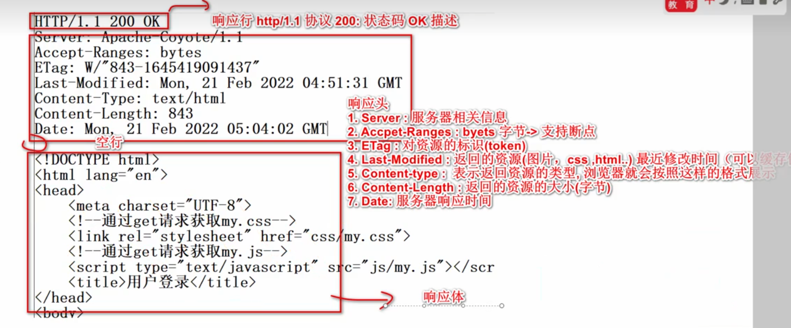
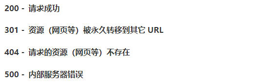
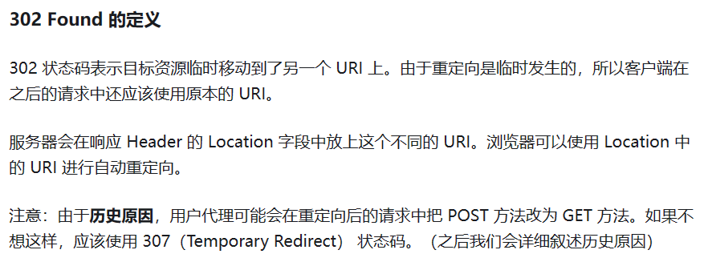
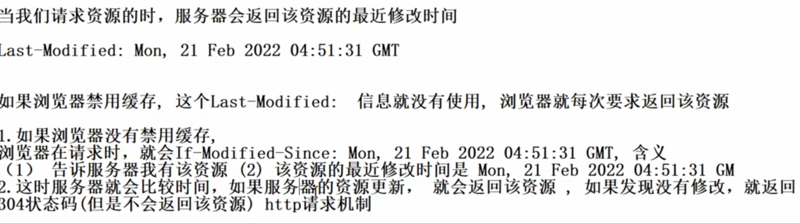

# HTTP协议学习笔记
[toc]
## 请求头
### 1. GET请求

### 2. POST请求

## WEB中哪些是GET请求？
### 1. form标签 method=get
### 2. a标签
```html
    <a href="http://www.baidu.com">goto百度</a>
```

### 3. link标签引入css
```html
    <link rel="stylesheet" href="css/my.css">
```

### 4. Script标签引入js文件
### 5. img标签引入图片
### 6. iframe标签引入html页面
### 7. 在浏览器地址栏中输入地址后按回车
## GET请求和POST请求
> GET请求和POS请求应该根据业务来分别使用，比如当请求网页资源时，用GET请求，而当登录，发帖或上传文件时，用POST请求
### 传输数据大小的区别
1. GET请求传输的数据量较小，一般不大于2KB
2. POST请求传输的数据量较大，一般默认不受限制
### 什么时候用POST请求？
1. 当上传的信息要求足够安全时，用POST请求可以隐藏信息
2. 向Server传递较大数据量时
### 什么时候用GET请求？
1. 前台页面展示，用get可以保留传递参数
2. 生成分享链接时，用get请求可以携带参数，利于分享
## 响应头

## 状态码
### 常见状态码

### 状态码 302 重定向机制

### 状态码 304 浏览器缓存机制
