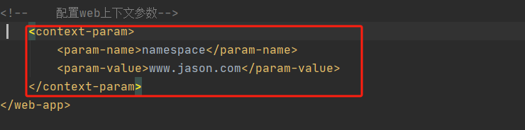

# Servlet 学习笔记
[TOC]
## 官方api文档
https://tomcat.apache.org/tomcat-8.5-doc/servletapi/index.html
## 为什么需要Servlet
创建一个与用户交互的动态页面，打通容器与数据库之间的交互
## 什么是Servlet
1. 一种服务器（Tomcat）调用的程序
2. 本质是java类
3. 需要按照Servlet规范编写
## quick start
### 1. 配置Servletapi jar包
   
   
### 2. 创建实现了Servlet接口的类，并实现其五个方法
   
### 3. Servlet接口重载方法的说明
   ```java
    /**
     * init()
     * 初始化Servlet
     * 当Servlet被创建实例时会被调用一次，
     * 即tomcat启动时调用
     * @param servletConfig
     * @throws ServletException
     */
    @Override
    public void init(ServletConfig servletConfig) throws ServletException {

    }
   ```
   ```java
    /**
     * getServletConfig()
     * 返回ServletConfig对象，返回Servlet配置
     * @return
     */
    @Override
    public ServletConfig getServletConfig() {
        return null;
    }
   ```
   ```java
    /**
     * service()
     * service 处理浏览器的请求（get、post）
     * 每次被请求时都会被调用
     * servletRequest是http请求的封装（Tomcat封装）
     * servletResponse是http响应的封装（Tomcat解析）
     * @param servletRequest
     * @param servletResponse
     * @throws ServletException
     * @throws IOException
     */
    @Override
    public void service(ServletRequest servletRequest, ServletResponse servletResponse) throws ServletException, IOException {

    }
   ```
   ```java
    /**
     * getServletInfo()
     * 得到当前servlet的相关信息
     * @return
     */
    @Override
    public String getServletInfo() {
        return null;
    }
   ```
   ```java
    /**
     * destroy()
     * 销毁当前的servlet实例
     */
    @Override
    public void destroy() {

    }
   ```
### 4. 在web.xml文件中配置Servlet，提供外部访问地址
```xml
<?xml version="1.0" encoding="UTF-8"?>
<web-app xmlns="http://xmlns.jcp.org/xml/ns/javaee"
         xmlns:xsi="http://www.w3.org/2001/XMLSchema-instance"
         xsi:schemaLocation="http://xmlns.jcp.org/xml/ns/javaee http://xmlns.jcp.org/xml/ns/javaee/web-app_4_0.xsd"
         version="4.0">
<!--    配置Servlet-->
    <servlet>
        <!--servlet-name 给servlet命名 -->
        <servlet-name>HelloServlet</servlet-name>
        <!--servlet-class servlet类的全路径
         用于给tomcat反射生成servlet使用-->
        <servlet-class>com.jason.HelloServlet</servlet-class>
        <!--load-on-startup 表示配置该Servlet是否启动时加载
        其中的内容文本表示启动时加载的顺序，由1开始 -->
        <load-on-startup>1</load-on-startup>
    </servlet>
    <servlet-mapping>
        <servlet-name>HelloServlet</servlet-name>
        <!--url-pattern 访问servlet路径 -->
        <url-pattern>/helloServlet</url-pattern>
    </servlet-mapping>
</web-app>
```
## *浏览器访问Servlet流程分析

**1。何时需要，何时创建**
**2。再次需要，重复调用**
**3。hashmap，实施维护**
## *Servlet生命周期

### Servlet加载-init()
1. 若开启load-on-startup 则Servlet在tomcat启动时得到自加载
2. 若没有配置load-on-startup 则Servlet会在首次收到http调用请求时加载
3. tomcat进行redeploy后，会销毁所有已有的Servlet实例，根据1，2的规则重新加载
### Servlet服务-service()
1. 当服务器收到一个http请求，服务器会产生一个新线程去处理
2. 同时tomcat也会对http请求进行解析封装成一个实现了ServletRequest接口的对象A，再创建一个实现了ServletResponse接口的对象B
3. 将对象A，B传入到Servlet的Service函数中,对其进行处理
### Servlet销毁-deploy()
1. 服务器关闭或重启时销毁所有Servlet前调用deploy()方法
## 更进一步--HttpServlet类
在实际开发中，用Servlet接口进行开发需要重写5个方法，且功能单一，对于复杂的需求无法实现。应而更多地使用，功能丰富，为http贴身定制的==HttpServlet类==

对于==HttpServlet==我们只需重写其中的**doGET**以及**doPOST**等等service方法，而其他的方法已经提前被该类写好，我们只需要写一个继承了httpservlet的子类即可。


## 使用注解对Servlet进行自动化配置
如上图所示，IDEA创建的servlet中存在一个名为==WebServlet==的注解，**其中注解包含了许多原来需要用xml技术配置的servlet信息。**

其原理是通过扫描包中的注解配置信息（被WebServlet注解的类），然后利用反射加载该类，得到注解信息，从而获取配置信息。
### 四种URL匹配模式
通过配置Servlet的url可以有效控制Servlet的作用域
#### 1. 精准匹配 "/urlName"
该匹配方式在访问时只能严格按照配置的url路径进行访问
例如要访问下面的Servlet只能访问http://localhost:8080/myWeb1/ok
```java
    @WebServlet(name = "hiHttpServlet",urlPatterns = {"/hiHttpServlet"})
public class hiHttpServlet extends HttpServlet {
    protected void doPost(HttpServletRequest request, HttpServletResponse response) throws ServletException, IOException {

    }

    protected void doGet(HttpServletRequest request, HttpServletResponse response) throws ServletException, IOException {

    }
}

```
#### 2. 目录匹配"/DirectoryName/* "
目录匹配下，在访问该目录及其子节点时，都会调用该servlet
**有效的访问**
1. http://localhost:8080/myWeb1/myServlet (访问该目录)
2. http://localhost:8080/myWeb1/myServlet/1 （访问该目录下任意节点）
3. http://localhost:8080/myWeb1/myServlet/aa/1 （访问路径包含该目录的任意的路径）
```java
    @WebServlet(name = "hiHttpServlet",urlPatterns = {"/myServlet/*"})
public class hiHttpServlet extends HttpServlet {
    protected void doPost(HttpServletRequest request, HttpServletResponse response) throws ServletException, IOException {

    }

    protected void doGet(HttpServletRequest request, HttpServletResponse response) throws ServletException, IOException {

    }
}

```
#### 3. 扩展名匹配 "*.extensionName"
访问格式为：http://localhost:8080/myWeb1/anyDirectory.../anyName.extensionName
只要最终访问路径含有对应的扩展名就会调用该servlet
**注意** 不能写为"  /*.extensionName  ",这样会导致tomcat报错
```java
    @WebServlet(name = "hiHttpServlet",urlPatterns = {"*.action"})
public class hiHttpServlet extends HttpServlet {
    protected void doPost(HttpServletRequest request, HttpServletResponse response) throws ServletException, IOException {

    }

    protected void doGet(HttpServletRequest request, HttpServletResponse response) throws ServletException, IOException {

    }
}

```
#### 4. 任意匹配 "/"  "/*"
当采用这种匹配方式，输入任意的url地址都会调用该servlet。一般不推荐使用，因为会覆盖tomcat的初始配置中用于处理访问静态资源的default Servlet。如果采用会导致静态资源无法正常访问。


## ServletConfig
每一个Servlet创建时都会有相应的ServletConfig对象被创建，同时利用ServletConfig对其进行初始化

通过ServletConfig我们可以得到对应的初始化参数，以及对应的Servlet名字和ServletContext。
由于HttpServlet已经实现了ServletConfig接口，我们可以直接调用对应的ServletConfig中的方法得到相应的配置参数，例如：

## ServletContext
ServletContext可以实现多个Servlet通信，用于表示Servlet的上下文对象

### ServletContext对象的特性
1. **一个web工程，只有一个ServletContext对象实例**
2. **ServletContext对象，在web工程启动时创建，在web工程停止时销毁**
3. **获取ServletContext对象的引用，可以通过ServletConfig对象中定义的getServletContext()方法**
4. **由于一个web中只有一个ServletContext对象，且允许所有Servlet对象访问，因而可以凭借ServletContext对象实现Servlet之间的通信。ServletContext对象也被称为域对象**
### 域对象
**所谓域对象，即可以在不同Servlet中进行数据传递的对象**
#### 域对象的方法
1. setAtrribute(name, value); 存储数据的方法
2. getAttribute(name); 根据name获取对应数据的方法
3. removeAttribute(name); 删除数据
### ServletContext对象的作用
1. **获取web工程配置的初始化参数getInitParameter()**
   1. 配置web.xml中的上下文参数**context-param**(此信息只属于web工程)
   
   2. 利用getInitParameter()得到相应的配置参数
    
2. **获取项目的工程路径getContextPath()**
3. **获取项目在服务器硬盘中的绝对路径getRealPath()**
   
## HttpServletRequest
浏览器发送来的http请求都封装在这个对象中，可以通过调用这个对象，来获得请求信息。每次请求的Request对象都封装在Tomcat这个容器中，不是由某个具体的Servlet所拥有的。

### HttpServletRequest常用的方法

**其中getHeader(请求字段名)可以得到发送的实际请求中的字段内容**
==需要注意的是==：HttpServletRequest也有setAttribute和getAttribute方法，说明其也是一个域对象，可以用来Servlet之间的通信
### 获取Http传来的表单数据

### 一些小细节
1. 如果获取参数出现乱码，应该设置Request的字符编码
   
2. 在利用Response返回时，也要设置ContentType，否则会出现乱码
## 请求转发
**之前学习的都是一次请求对应一个Servlet处理**

但当业务复杂时，需要对一次请求进行多次不同的处理，**就会需要用多个Servlet对功能进行拆分**

这时就需要进行让Servlet进行**请求转发**
所谓请求转发，就是当一个web资源收到客户端的请求后，再通知服务器去调用另外一个web资源对该请求进行处理

### 实现请求转发
1. **调用getRequestDispatcher()方法得到Request对象的分发器，其中参数填入下一个Servlet的工程地址**
2. **调用forward的方法并将，Request和Response作为参数传入其中，即可完成分发**

### 请求转发小细节

## HttpServletResponse


## 请求重定向

==注意== 在写重定向的servlet中本质上是需要由sendRedirect函数去直接返回相应的302返回消息，因而不应该在此Servlet中对Response进行更改或使用输出流

sendRedirect()函数中的参数与请求转发的参数格式不同，应该带上对应的web应用名，否则浏览器无法对其进行解析。
==原因== ：sendRedirect()是通过在响应头里的location字段告知浏览器进行重新访问的，其中location字段的值即为函数参数，浏览器在收到location字段后，通过与host字段(本地服务器为：localhost:8080)进行拼接来得到重定向后访问的url

通过重定向也可以，使重新定向到外部的网站，例如重定向到百度，则直接在参数中输入百度的完整协议+域名即可
