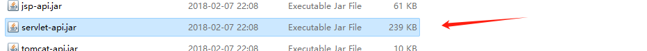

# Servlet 学习笔记
[TOC]
## 官方api文档
https://tomcat.apache.org/tomcat-8.5-doc/servletapi/index.html
## 为什么需要Servlet
创建一个与用户交互的动态页面，打通容器与数据库之间的交互
## 什么是Servlet
1. 一种服务器（Tomcat）调用的程序
2. 本质是java类
3. 需要按照Servlet规范编写
## quick start
### 1. 配置Servletapi jar包
   
   
### 2. 创建实现了Servlet接口的类，并实现其五个方法
   
### 3. Servlet接口重载方法的说明
   ```java
    /**
     * init()
     * 初始化Servlet
     * 当Servlet被创建实例时会被调用一次，
     * 即tomcat启动时调用
     * @param servletConfig
     * @throws ServletException
     */
    @Override
    public void init(ServletConfig servletConfig) throws ServletException {

    }
   ```
   ```java
    /**
     * getServletConfig()
     * 返回ServletConfig对象，返回Servlet配置
     * @return
     */
    @Override
    public ServletConfig getServletConfig() {
        return null;
    }
   ```
   ```java
    /**
     * service()
     * service 处理浏览器的请求（get、post）
     * 每次被请求时都会被调用
     * servletRequest是http请求的封装（Tomcat封装）
     * servletResponse是http响应的封装（Tomcat解析）
     * @param servletRequest
     * @param servletResponse
     * @throws ServletException
     * @throws IOException
     */
    @Override
    public void service(ServletRequest servletRequest, ServletResponse servletResponse) throws ServletException, IOException {

    }
   ```
   ```java
    /**
     * getServletInfo()
     * 得到当前servlet的相关信息
     * @return
     */
    @Override
    public String getServletInfo() {
        return null;
    }
   ```
   ```java
    /**
     * destroy()
     * 销毁当前的servlet实例
     */
    @Override
    public void destroy() {

    }
   ```
### 4. 在web.xml文件中配置Servlet，提供外部访问地址
```xml
<?xml version="1.0" encoding="UTF-8"?>
<web-app xmlns="http://xmlns.jcp.org/xml/ns/javaee"
         xmlns:xsi="http://www.w3.org/2001/XMLSchema-instance"
         xsi:schemaLocation="http://xmlns.jcp.org/xml/ns/javaee http://xmlns.jcp.org/xml/ns/javaee/web-app_4_0.xsd"
         version="4.0">
<!--    配置Servlet-->
    <servlet>
        <!--servlet-name 给servlet命名 -->
        <servlet-name>HelloServlet</servlet-name>
        <!--servlet-class servlet类的全路径
         用于给tomcat反射生成servlet使用-->
        <servlet-class>com.jason.HelloServlet</servlet-class>
    </servlet>
    <servlet-mapping>
        <servlet-name>HelloServlet</servlet-name>
        <!--url-pattern 访问servlet路径 -->
        <url-pattern>/helloServlet</url-pattern>
    </servlet-mapping>
</web-app>
```