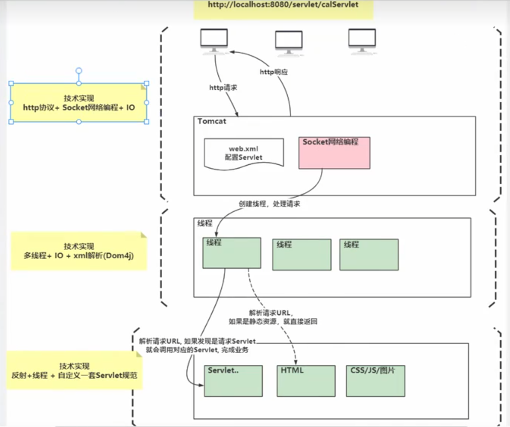

# Tomcat
[TOC]
## 什么是Tomcat
Tomcat是一个流行的开源的Java Servlet容器，也是一个用于托管Java Web应用程序的Web服务器。
## 为什么使用Tomcat
- 支持Java Servlet和JavaServer Pages (JSP)：Tomcat是一个用于托管Java Web应用程序的容器，可以处理Java Servlet和JSP技术创建的动态Web内容。
- 轻量级和灵活：Tomcat是一个轻量级的服务器，易于安装和配置。它提供了灵活性，可以根据需求进行定制和扩展。
- 开源和免费：Tomcat是开源的，因此免费使用。这使得它成为许多企业和开发者的首选，特别是对于那些寻求成本效益高的解决方案的情况。
## Tomcat的机制
- Servlet容器：Tomcat作为一个Servlet容器，负责管理和执行Servlet的生命周期。Servlet是Java编写的服务器端程序，用于处理客户端请求并生成响应。
- JSP容器：Tomcat还作为JSP容器，负责解析JSP页面、编译成Java代码、执行和生成响应。JSP是一种动态网页技术，允许在HTML中嵌入Java代码，从而实现动态生成网页内容。
- HTTP服务器：Tomcat还充当一个HTTP服务器，用于处理HTTP请求和响应。它通过监听特定的端口（通常是80端口）来接收来自客户端的请求，并根据配置的规则将这些请求路由到相应的Servlet或JSP进行处理。
- 线程池管理：Tomcat使用线程池来处理并发请求，通过限制并发连接数和维护线程池来确保服务器资源的有效利用和稳定性。
- 虚拟主机支持：Tomcat支持虚拟主机，允许在同一服务器上托管多个域名。这意味着可以使用单个Tomcat实例来托管多个网站，从而提高资源利用率。
- 安全性管理：Tomcat提供了许多安全特性，包括对SSL的支持、访问控制、认证和授权机制等，以确保Web应用程序的安全性。
- 高可用性和可扩展性：Tomcat可以与其他技术（如Apache HTTP服务器、反向代理、负载均衡器等）集成，以实现高可用性和可扩展性，从而满足大型企业级应用程序的需求。
## Tomcat框架图
