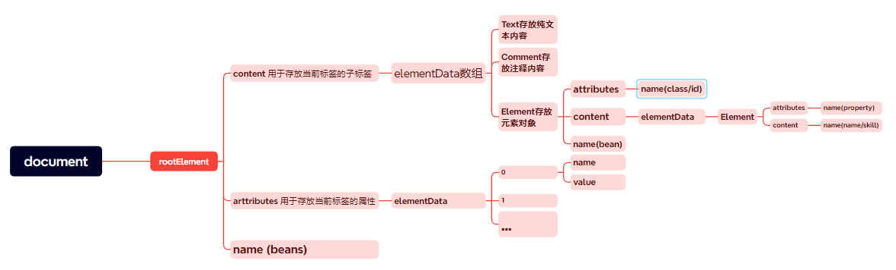

# XML学习笔记
[TOC]
## 1.为什么需要XML
1. 两个程序进行数据通信可以用XML
2. 服务器的初始配置文件可以用XML
3. XML可以存储复杂的数据关系
***
## 2.例子
1. Spring的IOC配置文件，beans.xml
2. mybatis的XXXMapper.xml
3. Tomcat的server.xml  web.xml
4. Maven的pom.xml
***
## 3.XML文件示例
```xml
<?xml version="1.0" encoding="UTF-8" ?>//文档说明
<students>
    <student id="100">
        <name>jack</name>
        <age>18</age>
        <gender>男</gender>
    </student>
    <student id="200">
        <name>tom</name>
        <age>19</age>
        <gender>男</gender>
    </student>
</students>
```
同理xml文件也可以映射成一个DOM

***
## 4.XML文件的构成
1. 文档声明
2. 元素
3. 属性
4. 注释
5. CDATA区，特殊字符
### 4.1 文档声明
1. 文档声明应放在XML文档的第一行
### 4.2 元素
1. 每个XML文档必须有且只有一个根元素
2. 元素命名是区分大小写的、不包含空格、不以数字开头、且不能包含冒号
### 4.3 属性
1. 属性是写在元素标签内的键值对
2. 每个元素不能有多个重复的属性
3. 属性名称区分大小写
### 4.4 CDATA节
用CDATA节包含的文本不会被XML解析引擎解析，而是当做普通文本内容
```
    <![CDATA[
    在这里键入你的文本
    ]]>
```
***
## 5.DOM4J--XML解析技术
### 5.1 解析原理
1. 不管是html文件还是xml文件都是标记型文档，都可以使用w3c组织制定的dom技术来解析
2. 将文档映射成dom对象后可以通过java技术对dom对象进行相关操作
### 5.2 加载xml文件
```java
public class Dom4j_ {
    //加载document
    public Document loadXML() throws DocumentException {
        SAXReader reader = new SAXReader();//创建解析器
        Document document = reader.read(new File(url));//通过文件对象解析得到document对象
        return document;
    }
}
```
### 5.3 遍历xml指定元素
```java
public void listStus() throws DocumentException {
        //得到解析器
        SAXReader saxReader = new SAXReader();
        //通过解析器得到对应的dom对象
        Document document = saxReader.read(new File("students.xml"));
        //得到根元素，即<students></students>
        Element rootElement = document.getRootElement();
        //得到根元素的所有标签为student的元素
        List<Element> student = rootElement.elements("student");
        for (Element element: student
             ) {
            //在每个student元素下再寻找name元素、age元素、gender元素得到信息
            Element nameEle = element.element("name");
            String name = nameEle.getText();
            Element ageELe = element.element("age");
            String age = ageELe.getText();
            Element genderEle = element.element("gender");
            String gender = genderEle.getText();
            System.out.println("学生信息 =" + name + " " + age + " " +
                    gender );
        }
    }
```
### 5.4 指定读取一个元素
```java
    @Test
    public void readOne() throws DocumentException {
        SAXReader saxReader = new SAXReader();
        Document document = saxReader.read(new File("students.xml"));
        Element rootElement = document.getRootElement();
        List students = rootElement.elements("student");
        //得到元素列表后通过list的get操作，利用索引得到指定元素
        Element firstStu = (Element)students.get(0);

        System.out.println("学生信息 =" + firstStu.element("name").getText() + " " + firstStu.element("age").getText() + " " +
                firstStu.element("gender").getText() );

        //得到element的属性
        System.out.println("id = " + firstStu.attributeValue("id"));
    }
```
### 5.5 dom4j增删改查
1. 增加一个元素
```java
    @Test
    public void addOne() throws DocumentException, IOException {
        //得到xml文件对应的dom对象以及根节点
        SAXReader saxReader = new SAXReader();
        Document document = saxReader.read(new File("students.xml"));
        Element rootElement = document.getRootElement();

        //利用DocumentHelper以及create、set、add方法创建一个元素节点
        Element newStu = DocumentHelper.createElement("student");
        //设置属性 键值对
        newStu.addAttribute("id","300");

        Element name = DocumentHelper.createElement("name");
        name.setText("mary");
        newStu.add(name);

        Element age = DocumentHelper.createElement("age");
        age.setText("20");
        newStu.add(age);

        Element gender = DocumentHelper.createElement("gender");
        gender.setText("女");
        newStu.add(gender);

        //将创建的元素加到对应的母节点上
        rootElement.add(newStu);

        //设置输出格式以及文件输出流

        OutputFormat prettyPrint = OutputFormat.createPrettyPrint();
        prettyPrint.setEncoding("utf-8");

        XMLWriter xmlWriter = new XMLWriter(new FileOutputStream(new File("students.xml")), prettyPrint);
        xmlWriter.write(document);
        xmlWriter.close();

        //查看是否正确插入
        listStus();

    }
```
2. 删除一个元素
```java
    @Test
    public void deleteOne() throws DocumentException, IOException {
        SAXReader saxReader = new SAXReader();
        Document document = saxReader.read(new File("students.xml"));

        //找到目标元素
        Object o = document.getRootElement().elements("student").get(2);
        Element student = (Element)o;

        //调用自身的attribute属性以及remove方法删除属性
        student.remove(student.attribute("id"));

        //通过找到母元素，调用母元素的remove方法删除对应的元素
        student.getParent().remove(student);

        OutputFormat prettyPrint = OutputFormat.createPrettyPrint();
        prettyPrint.setEncoding("utf-8");

        XMLWriter xmlWriter = new XMLWriter(new FileOutputStream(new File("students.xml")),prettyPrint);
        xmlWriter.write(document);
        xmlWriter.close();

        listStus();
    }
```
## 6.利用dom4j通过读取xml创建java对象
```java
    @Test
    public void createObjectByXML() throws DocumentException {
        SAXReader saxReader = new SAXReader();
        Document document = saxReader.read(new File("students.xml"));
        List<Element> students = document.getRootElement().elements("student");
        ArrayList<Student> studentList = new ArrayList<>();

        //利用dom4j解析技术获得每一个student节点下的属性，
        // 并创建对象存储到arraylist中
        for (Element student:students) {
            Student Student = new Student(student.element("name").getText(),
                    Integer.parseInt(student.element("age").getText()),
                    student.element("gender").getText());
            studentList.add(Student);
        }

        //显示是否创建成功
        for (Student student: studentList) {
            System.out.println(student);
        }
    }
```