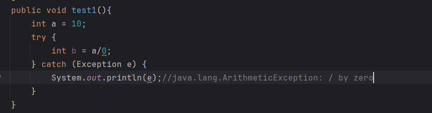
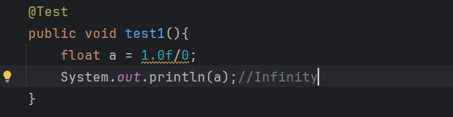
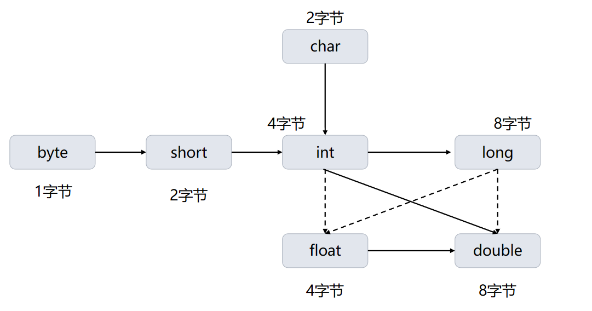
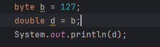
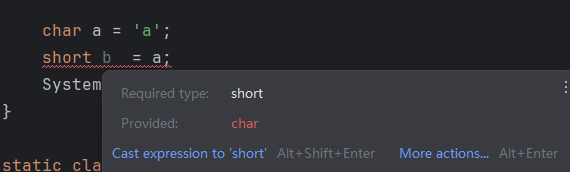

# 运算符相关
## 除0
1. 对于整数类型，除0，将会产生一个异常。
   
2. 对于浮点类型，除0，则会得到一个无穷大，或NaN结果。
   
## 数值类型之间的转换
数据类型的合法转换图如下所示

其中，实线箭头表示数据可以**无损转换**，而虚线箭头表示**有损转换**，即纯在精度丢失。
**注意**：只要在图中，一个数值类型可以沿着箭头到达另一个数值类型，就可以完成数值数值类型转换。
例如:
byte 转double:

但char不能自动转成short:

这时只能进行强制类型转换
## 强制类型转换
如上，不能通过合法数值类型转换时，可以通过强制类型转换使数值得到转换。
```java
    double x = 9.997;
    int nx = (int)x;
```
强制类型转换通过截断二进制值实现，当转换是由浮点型转向整型时，会切断小数部分。
## 赋值中的强制类型转换
在赋值二元运算的简写形式“+=、-=。。。”中，如果运算符得到的数的类型与左侧数的类型不同，则会发生强制类型转换。

```java
    int x = 1;
    x += 3.5;
//相当于
    int x = 1;
    x = (int)(x + 3.5);//结果为4
```